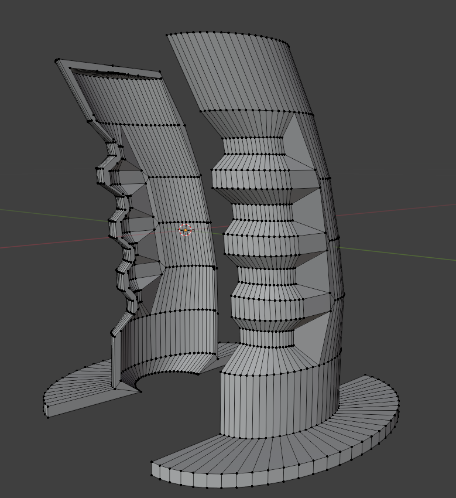
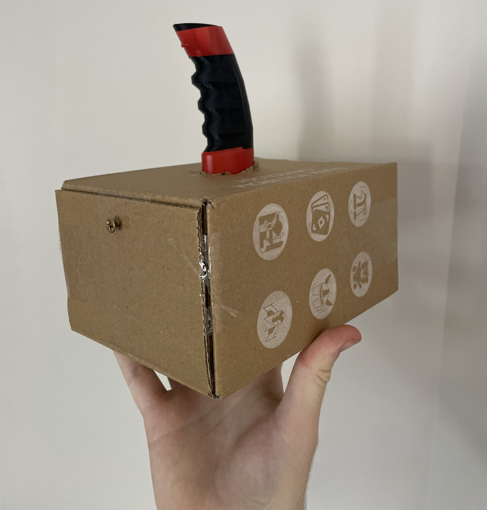
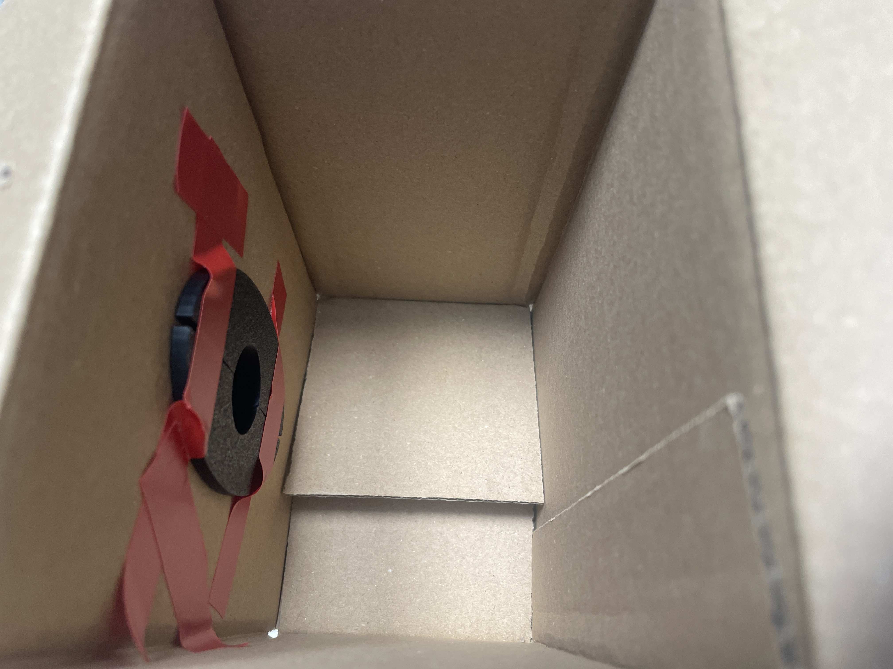
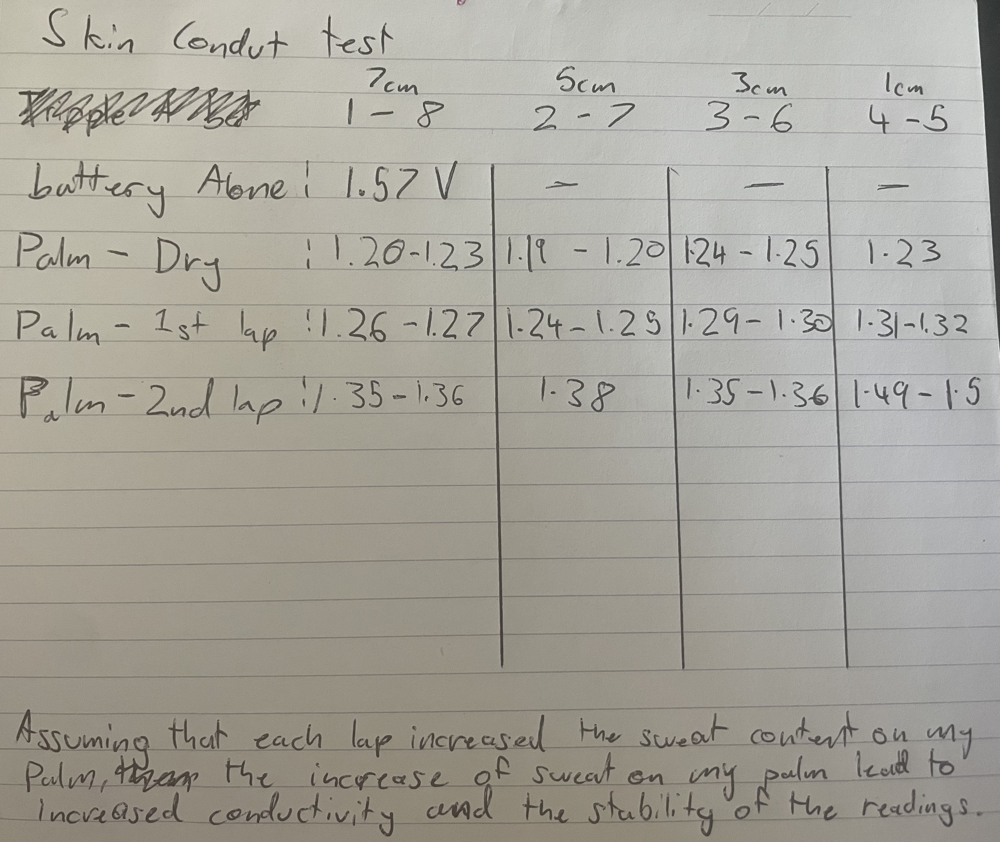
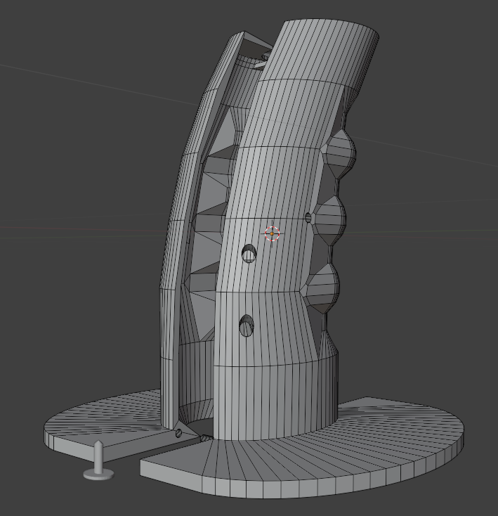
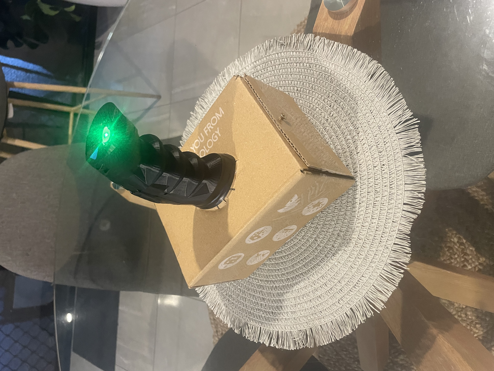
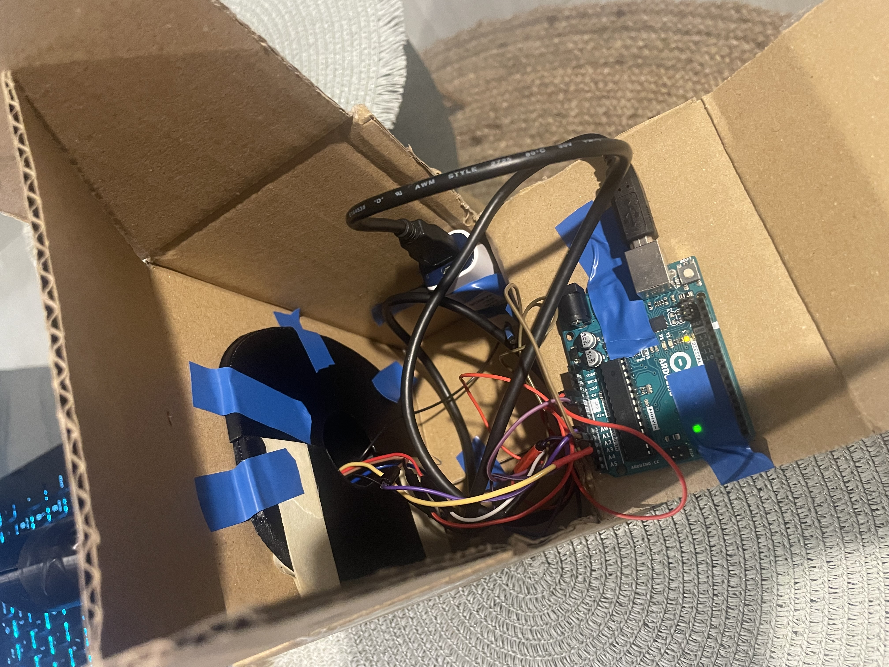

# DES222 Process Journal

## Initial Ideas
Simple initial ideas that could be expanded upon for the project:

- **Heart Shirt:** A Shirt with LEDs in a heart shape that flashes with the beating of the wearers heart.
- **Auto Lamp:** A lamp that gets brighter as the enviroment gets darker
- **Needy Robot:** A little robot that follows people and avoids obsatcles.
- **Med-Boy:** A device on the wrist/forearm that has a bunch of biometrics to monitor wearers health.
- **Shock Roulett:** More of a game, a small device that people will take turns holding that will randomly make a loud noise or small shock made more likely by how nervous the user is.

## Detailed Idea

### General Idea
Three handles connected to a main unit that holds a microbit processor. Each of the handles will have sensors to detect pluse and how sweaty the hands of the person holding the handle is and a vibration motor or some way to shock the holder. When a button on the device is pressed a "weight" is assinged to each handle based on how nervous the user by detecting their pulse and sweat of their palm. the device will then pick a handle at random, being more likely to pick a handle with a higher weight, to shock.

### Main Unit
The main unit of the prototype will be a box made out of cardboard beacuse cardboard is an easy material to work with and for the purpouses of this prototype, there are currently no other design restrictions what would require a different material. The handle would be firmly mounted in the middle on top of the box.

Alternatively the unit could have a trench for the user to rest their arm in while they grab the handle. This way the device could read the pulse from the users arm rather than their palm if the palm is too unreliable. 

The internals of the main unit would be comprised of a Micro:Bit proccessor, this is because of my familiarity with Micro:Bits but may need to be changed to a different microcontroller like an Arduino if required.

### Handles
The handles will be 3D-printed in two halfs that snap together to form an ergonomic shape for a hand. There will be varous holes in the back of the handles for the different sensors and the shock method 

### Activation / Use
I have three ideas for how the device can be activated / will be used:

1. Each handle has an individual button and the users will press the buttons individually when indicated to do so by LEDs on the main unit. When the button is pressed the device will alocate a chance of being shocked ranging from somewhere between 40% - 90% based on how nervous the device thinks the user is.

2. Theres one button on the main unit and when the button is pressed there will be a countdown and near the end of the countdown each handle's weight will be computed and the device will choose a handle to shock at random, weighted towards those that were detected to be more nervous.

3. A lose combination of the above methods, one handle connected to the main unit either by cables or being fully connected into the main unit. When the button on the handle is pressed some kind of countdown (i.e. A speaker counting down, A speaker playing a short tune, LEDs turning off) near the end of the count down a weight will be assigned based off how nervous the device thinks the user is. The device is then more likely to shock the user based on nerves in a similar range to the first idea.

Right now the prefered option is the third due to having fewer inputs to manage and a lower material cost needing to only make one handle as opposed to three.

### Method of sending Shock
There are current two ideas for how the shock will be administered to the user:

1. In the back of the handles there will be two metal strips that are covered by the user's palm making a ciruit with a small capacitor and a switch within the device, shocking the user when the circuit is completed.

2. In the handle there is a vibrating motor conncted to a small "spike" or tab in the back of the handle facing the users palm, the spike isn't sharp. When the device triggers the motor the spike will rappidly jab the users hand, causing a "shock" without inflicting any real damage.

Right now the best option of the two would be the vibrating spike mainly due to the uncertainty of how well the device could administer a shock that will suprise the user without causing them much harm.

### Additional Thoughts
A list of thoughts I had during the development of this idea that might be implemented:
- A reverse pity system where the device makes you more likley to be shocked based on how many times you haven't been.
- A way to switch between the first two modes mentioned in the Activation / Use section.
- A way for the device to detect the body heat of the user.
- Polygraph API

### Similar Examples
- **Lightning reaction reloaded**; When the button on the main unit is pressed it will go red, when it goes green players must press the button on the top of their conrolers and the last person to press their button gets shocked.

- **Amazing Roulette**;  Players stick their fingers into the holes on the top of the device and one will be shocked at random.

<!-- ## Image
 -->

## Initial 3D modeling
The first step that was taken was the initial 3D modeling of the handle of the device. The first handle was made to test for both the comfort of the user and to see where the user's hand would rest so that the biometric sensors could be placed appropriately.

The handle was designed to be hollow to allow for wires to run internally to the sensors on the handle. The curve of the handle as well as the ridges on the front are to improve the ergonomics for the user grasping the handle.

## Initial Programming 
The programming for the device started with making a program to take the data from the pulse sensor and transforming it into the users BPM. First, before transforming the data, the device smooths the data using the equation: 
smoothed variable = raw variable * weight  +  smoothed variable * (1 - weight)
the weight was set to 5% and this made the input much smoother. Then the program checks to see if the readings go above a specified threshold, indicating a beat. when it did the program would record the time of the beat and would not record any more times until the readings went below the threshold. It would also keep note of the time of the second most recent beat, then do the calculation: 60000 / (Most recent beat - Last beat) to calculate how many times the heart beats per minute.

## Handle and Box Prototype
The handle was placed through a hole made in the top of the box and mounted from the inside using tape and friction within the box. From this prototype it can be seen that the handle was made too small, this is because of an issue made with the measurements, but the box itself is a perfect size to fit the electronics of the project. Additionaly, the screw holding the face of the box allows for easy access to the inside without allowing for the box to open accidentally.

## Sweat conductivity testing
To make sure that the way of testinf for sweat would work, a group member would run the same route around the campus and between each run, the conductivity of their palm would be taken four times with different distances between the positive and negative nodes on their palm.

The test indicated that there was infact a corilation between the conductivity of a persons palm and the amount of sweat present on their palm.

## Second Handle Model
The second design for the handle was made to be bigger and the edges of the ridges were smoothed to increase the ergonomics. Holes were specifically placed on the handle to allow for a small spike to be poked through as well as additional holes for screws to be used as nodes to measure the skin conductivity. The top of the handle was made concave to allow for the users thumb to rest within it and a hole in the middle for the pulse sensor to measure from the user's thumb.The base was made wider and pins with corresponding holes were also placed in the base of the handle to allow for some structre when putting the two halfs together.

## Programing palm conductivity
One node would go to positive and the other would be read by one of the pins in the arduino, this allowed for the conductivity to be measured. An issue that was unaccounded for however was that the skin might be very conductive, as such the readings would only come back as though there was no resistance. After a couple of attempts to fix this issue by adding resistors and reduceing the power from 5V to 3.3V neither of which worked, the isse was left to fix later.

## Programming weighted shock
The weighted shock workes by taking the weight value then randomly generating a number and of the generated number is lower than the weight it would trigger the haptic motor in the handle. By default the weight is set to thirty and can reach a maximum of ninety. The BPM was weighted with thresholds, if the users bpm went above a certain threshold then the respective weight would be added to the total (+10, +20, +30). The sweat weight used a calculation, the readings would be divided by 34.1 and added to the total weight so that at maximum conductivity and additional 30 would be added to the total weight. This is done every 3 seconds that the device detects a user holding the handle using the sweat sensors.

## Project soldering
My partner did the soldering for the device based on an example that was set up on a bread board. The wires were mainly soldered onto the positive and negative power rails on the side of a protoboard. Some of the soldering broke or was wired to the wrong polarity of power rail, and was required to be resouldered by myself. This lead to different wires being used for the palm conductivity which actually helped improve the accuracy of the readings, fixing the problem encountered earlier.

## Final Prototype
The handle was printed too large and the pin to be inserted into one of the holes was missing due to forgetting to tell the tutors when they printed it. The increased size lead to having to make changes to the design to fit the handle, the opening in the box was made larger to acomodate the handle with the additional bonus of allowing easier access to the arduino board.

The wires used to measure the palm condctivity were fed through the snall hole ment for the pin and taped to the side of the handle where most people's palms would rest. Internally the wires were taped to the side of the handle to help hold the position of the sensors on the outside of the handle, along side the haptic motor due to not having a pin to attach it to. 

Within the box the protoboard was taped to the bottom near the back next to a power bank to allow the device to function without an external power source. The arduino was taped to the "door" of the box to allow for easy access.

## Future Improvements and Final Statement
While the final prototype came out well there are certain areas that can be expanded upon further in the future:
- Adding an actual shock
- Adding a way to give feed back when the user is not shocked
- A more secure way of holding the arduino board
- A more reliable way to detect the sweat on the user's palm
- Other biometric scanners

Overall the project is a good proof of concept that reacts to it's external enviroment without being directly controlled by a person, And it can be iterated upon in the future to become more reliable in detection of biometrics and the admistration of shocks.